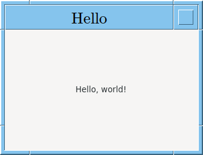

To build:

```
nix-shell
make
```

NOTE: if the window flashes black before painting, it's not a problem with the code. This is expected for GTK4 on X11 with the GPU renderer. Running:

```
GSK_RENDERER=cairo ./hello
```

Will fix it.
